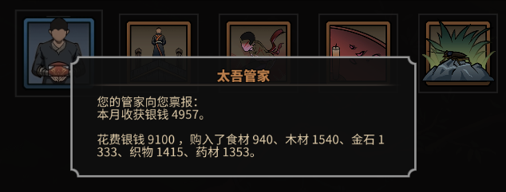
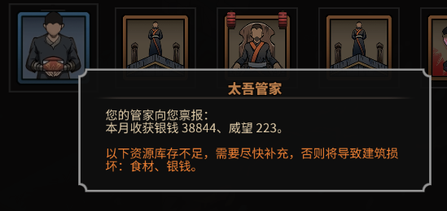
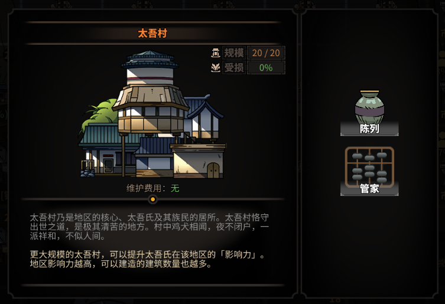
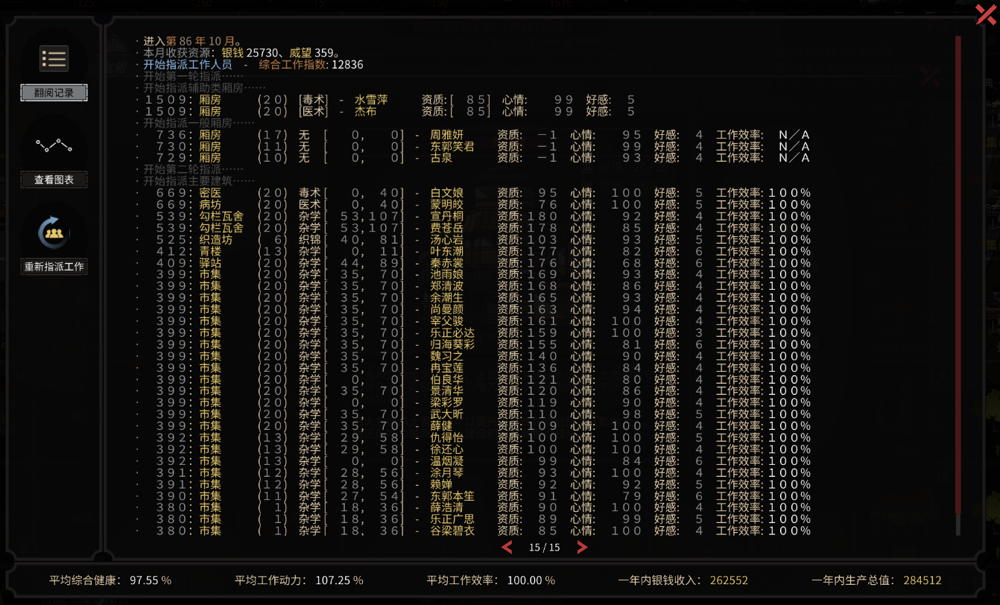
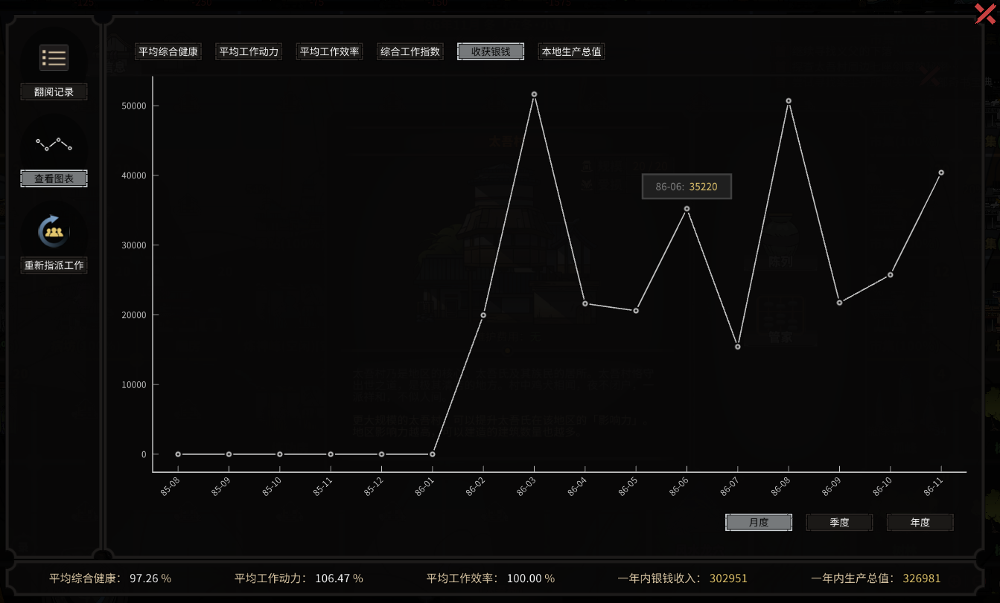
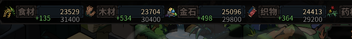
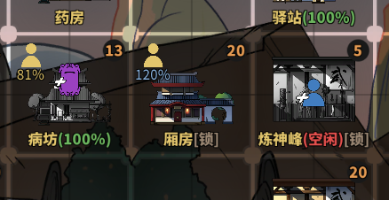

# 简介
此 mod 作用为帮助太吾传人管理太吾村，目前实现的功能有：

- 收获太吾村的产出
- 在过月事件列表中展示统计信息
- 在管家界面中展示历史记录、统计图表
- 资源量未达到预期时自行购入
- 资源不足时进行提醒
- 自动指派建筑工作人员

# 功能说明
## 收获太吾村的产出
- 在过月时自动进行产出品（资源、物品、村民）的收获。
- 可配置不自动收获物品、不自动接纳新村民。
- 可配置过滤指定性别、魅力、立场、资质的新村民。

## 在过月事件列表中展示统计数据
目前展示的统计信息有：

- 上月自动收获统计
- 上月资源购买情况
- 资源严重不足提醒

## 在管家界面中展示历史记录、统计图表
进入太吾村建筑内，点击管家按钮，可以打开管家界面。  
管家界面功能：展示管家相关日志、提醒；展示各种指标的当前值以及统计图表；点击按钮重新指派工作。  
管家界面消息可在 mod 配置界面选择过滤级别，只展示重要度高的消息。  
管家相关历史记录存入游戏存档，并只保留近两年的的消息，近一百年的各种指标。  

## 资源量未达到预期时自行购入
- 主界面的资源栏上，当前资源的下方，会显示灰色的资源期望保有量。当资源低于期望值时，管家会尝试自行购买资源。  
- 在资源栏上点击左键会增加资源期望保有量，点击右键会减少资源期望保有量，可按住鼠标左/右键快速调整该值。  
- 当鼠标移动到屏幕顶部时，才会显示资源期望保有量。  
- 如果当前银钱高于配置项“银钱最低保有量”以及“资源保有量警戒值”，则过月时会用多出的银钱按照期望值购买资源。每月商队类型、商品出售量和主角待在太吾村时每月碰到的行商保持一致（即有可能某些月份没有资源包出售）。  

## 资源不足时进行提醒
- 配置项：资源保有量警戒值（为每月资源消耗量的倍数），如果当前资源低于警戒值，则管家会在过月事件中进行提醒（银钱也是资源的一种）。  

## 自动指派建筑工作人员
开启此功能后，每月初会自动对所有建筑指派工作人员。  
由于建筑工作进度会在月末增加，所以玩家可以在自动指派的结果生效之前，随意进行更改。  
自动指派逻辑为，首先把各个需要工作人员的建筑按照优先级排序，然后按优先级从村民中选取分配工作人员。  
建筑指派优先级计算公式为：优先级 = 建筑种类因子 * 标准状态下满效率需求的标准化能力值。  
从村民中选取工作人员时，对应工作效率越高，越优先选取。对于厢房，选取条件为人物心情好感与标准值（目前标准固定为好感喜爱、心情欢喜）的差距，差距越大越优先选取。  

分配时考虑厢房对工作效率的加成效果：  

- 如果某个建筑找不到标准状态下满效率的工作人选，那么就看其邻接区域有没有厢房，有则选择一个当作增加工作效率的厢房。  
- 所有建筑都过完之后，对每个增加工作效率的厢房，按统合建筑优先级的顺序，根据其所需能力类型列表，寻找最优的人选。  
- 所有增加工作效率的厢房决定好人选后，再为剩下的一般厢房分配人员，然后更新全部建筑需求列表，重新进行一次标准分配流程。  

其他功能：  

- 用户可配置建筑排除列表，对列表内的建筑不自动指派工作人员。  
- 用户可配置建筑类型优先级因子，以调整各种建筑的优先级。  

# 更新历史
## 2020-02-10: 1.2.11
适用游戏版本: 0.2.7.5

- 更改：重新编译以适应游戏 0.2.7.5 版本。

## 2019-12-20: 1.2.10
适用游戏版本: 0.2.6.19

- 更改：重新编译以适应游戏 0.2.6.19 版本。

## 2019-09-30: 1.2.9
适用游戏版本: 0.2.6.x

- 更改：调整以适应游戏 0.2.6.x 版本。
- 修复：管家日志界面内, 如果某条日志过长, 会导致界面报红字。

## 2019-09-02: 1.2.8
适用游戏版本: 0.2.5.x

- 更改：调整以适应游戏 0.2.5.x 版本。

## 2019-07-31: 1.2.7
适用游戏版本: 0.2.4.0

- 更改：细微调整以适应游戏 0.2.4.x 版本。

## 2019-06-30: 1.2.6
适用游戏版本: 0.2.3.0

- 更改：更改图片载入方法以适应 0.2.3.x 版本。

## 2019-04-05: 1.2.5
适用游戏版本: 0.2.0.0

- 修复：每次重启游戏后，建筑类型优先级因子都会恢复到默认值。

## 2019-03-29: 1.2.4
适用游戏版本: 0.2.0.0

- 修复：修改编译依赖以适应新的游戏版本。

## 2019-02-24: 1.2.3
适用游戏版本: 0.1.9.0

- 修复：自动指派工作人员时，错误地向正在新建、拆除的建筑指派了人员。

## 2019-02-17: 1.2.2
适用游戏版本: 0.1.8.4

- 修复：新开档案时旧的管家记录没有被清除。

## 2019-02-13: 1.2.1
适用游戏版本: 0.1.8.4

- 更改：完善参数配置界面的浮点数输入逻辑。感谢 sth4nothing 提供的代码。

## 2019-02-12: 1.2.0
适用游戏版本: 0.1.8.4

- 更改：调整建筑自动指派优先级公式。  
- 增加配置项：建筑类型优先级因子。  
- 更改：自动分配时，对于真正无适合人选的建筑，才给出红字警告。  
- 修复：没有任何村民时，进入图表界面卡死。  

## 2019-02-10: 1.1.1
适用游戏版本: 0.1.8.4

- 修复：在即时读档时界面初始化失败。
- 修复：没有任何管家记录时重新分配，分配完后记录会停留在第 0 页。
- 修复：如果存档中没有任何管家记录，取档之后会保留之前的管家记录。
- 修复：当所有月份的数据完全相等时，在创建图表界面卡死。
- 修复：在 X 轴上没有标签的数据，在提示窗口中也没有标签。
- 调整：图表中最多展示 60 个数据。

## 2019-02-10: 1.1.0
适用游戏版本: 0.1.8.3

- 增加功能：管家界面增加图表查看功能，可选择不同指标和不同粒度。

## 2019-02-03: 1.0.2
适用游戏版本: 0.1.8.1

- 修复：管家界面内的消息记录窗口，当没有任何消息文字时，多次进入会抛出异常。

## 2019-02-03: 1.0.1
适用游戏版本: 0.1.8.1

- 修复：管家界面内的消息记录窗口，当消息文字超过一定量时会抛出异常。

## 2019-02-03: 1.0.0
适用游戏版本: 0.1.8.0

- 增加管家界面，从太吾村建筑内点击“管家”按钮进入。
- 管家界面功能：展示管家相关日志、提醒；展示综合工作指数、一年内银钱收入等统计信息；点击按钮重新指派工作。
- 管家相关历史记录存入游戏存档，并只保留近两年的的消息，近十年的其他数据。
- 增加配置：管家界面消息重要度过滤。

## 2019-01-27: 0.13.1
适用游戏版本: 0.1.7.5 [Test]

- 修复：过滤新村民的魅力参数与资质参数混淆。
- 修复：同时接纳多个新村民时，只显示一个村民的信息窗口。

## 2019-01-27: 0.13.0
适用游戏版本: 0.1.7.5 [Test]

- 增加功能：可配置过滤指定性别、魅力的新村民。

## 2019-01-22: 0.12.2
适用游戏版本: 0.1.7.5 [Test]

- 修复：建筑需要辅助厢房才能达到满效率时，可能无法分配正确人员到辅助厢房。

## 2019-01-18: 0.12.1
适用游戏版本: 0.1.7.4 [Test]

- 修复: 兼容 test 分支的游戏版本 0.1.7.4。

## 2019-01-08: 0.12.0
- 增加功能：用户可配置建筑排除列表，对列表内的建筑不自动指派工作人员。  
- 增加配置：自动指派的排除建筑快捷键。  

## 2019-01-01: 0.11.0
- 继续改进自动指派建筑工作人员，分配时考虑厢房对工作效率的加成效果。
- 每次自动指派前后，输出综合工作指数到控制台。

## 2018-12-27: 0.10.0
- 动态加载游戏资源，不再和任何其他 mod 发生冲突了。
- 不再依赖 BaseResourceMod。

## 2018-12-26: 0.9.2
- 修复：修改过月事件图标编号，以回避与新版本图标的冲突。

## 2018-12-18: 0.9.1
- 修复：自动指派建筑工作人员时，把未成年及队伍中的村民也算进去了。

## 2018-12-18: 0.9.0
- 增加功能：自动指派建筑工作人员。

## 2018-12-17: 0.8.0
- 添加配置项：过滤指定立场的村民、资质小于指定值的村民。

## 2018-12-08: 0.7.0
- 添加配置项：接纳新村民时显示人物窗口。

## 2018-11-29: 0.6.0
- 调整功能: 管家购买资源的频率从三个月一次改为每个月一次，每月商队类型、商品出售量和主角待在太吾村时每月碰到的行商保持一致（即有可能某些月份没有资源包出售）。  
- 增加功能: 如果同时安装了“提升商人的商品数量” mod，则会同时提升管家可购买的资源数量。  

## 2018-11-25: 0.5.0
- 增加功能：资源量未达到预期时自行购入。
- 增加功能：资源不足时进行提醒。

## 2018-11-18: 0.0.2
- 可选择不自动收获物品（也同时不显示在统计中）。
- 更改月初事件图标。
- 依赖 BaseResourceMod v1.0.7。

## 2018-11-17: 0.0.1
- 自动收获太吾村的产出。
- 在月初事件列表中展示当月收获统计。
- 可选择不自动接纳新村民（也同时不显示在统计中）。
- 依赖 BaseResourceMod v1.0.6。

# 特别感谢
- jmswzyk: 游戏逻辑分析。
- somontano: 新功能代码提交。
- sth4nothing: 贡献基础功能代码。
