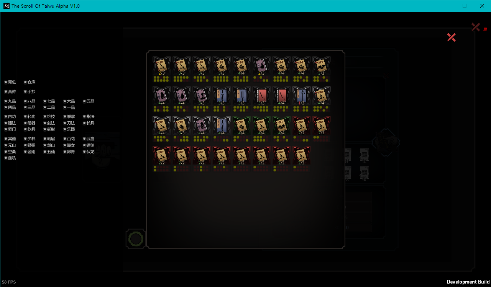

# UseStorageBook
> By sth4nothing  

修习仓库中的书  
可在选书界面筛选书籍，包括仓库背包、真传手抄、品级、门派等  
依赖**GuiBaseUI** [https://github.com/phorcys/Taiwu_Mods/GuiBaseUI/]

---
## 1.2.4
- 修复修习技艺时工作异常的bug
- 优化修习技艺时筛选的UI

## 1.2.3
- 选书界面添加“全部”按钮
- 书籍图标显示帮派信息
- 还原书籍缺页图标的颜色

## 1.2.2
- 修复更改筛选后书籍的缺页情况显示错误的bug  

## 1.2.1
- 增加书籍阅读进度的筛选（未读、已读、读完）  

## 1.2.0  
- 优化选书界面加载速度
- 选书界面筛选书籍功能
