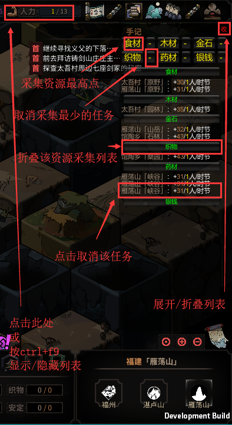

# VillageHeadOfTaiwu(太吾村支书)

**村民资源采集任务管理**

## 更新日志
### 1.2.4
- 修复委派人力、取消人力时可能出现的异常
### 1.2.3
- 兼容19-9-2\[TEST\]
### 1.2.2
- 兼容0.2.3.0
### 1.2.1
- 修复快速读档时点击人力图标无法切换列表显示的错误
### 1.2.0
- 优化界面
### 1.1.9
- 优化启动时遮挡的panel的大小
### 1.1.8
- 修正地图大小判断错误
### 1.1.7
-  可设定采集区域(仅限已探索出的地块)
    1. 角色当前地图
    2. 太吾村
    3. 所有地图
### 1.1.6   
- 修复游戏中调整分辨率时显示异常的bug(感谢@HY-Leung)
### 1.1.5  
- 修复游戏中读档可能触发的bug  
- 支持按资源采集量排序(*Ctrl+F10*启动UnityModManager设置升序或降序)  
### 1.1.4  
- 修复返回主界面后重新读档后列表无法关闭的bug
### 1.1.3  
- 优化界面，防止折叠后仍然遮挡
### 1.1.2  
- 修复取消人力时可能出现的bug
### 1.1.1  
- 可折叠列表
### 1.1.0  
- 支持在显示任务列表时操作游戏
- 分辨率自动适配
- 分配任务时可选是否忽略城镇(防止分配到城镇中占用过多人力)
### 1.0.4  
- 修正无法翻页&撤回人力的bug
- 支持自定义快捷键
### 1.0.3  
- 增加村民任务分配功能。
### 1.0.2  
- 修正移除人力后图标仍然存在的bug
